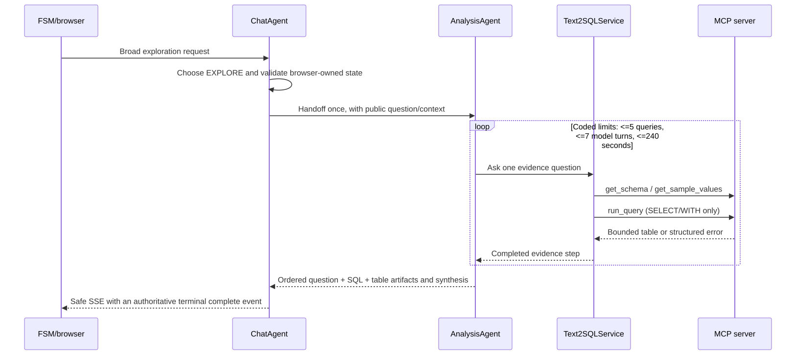

# Sherlock: Agentic AI Assistant for Fraud Managers

Sherlock is a demo of an agentic AI assistant for Fraud Managers. It turns an
investigative question into evidence, a candidate SQL predicate, and a historical
backtest. It is decision support: it does not deploy rules or make live payment
decisions.

> A candidate rule is a reviewable hypothesis. A Fraud Manager must assess its
> logic, false-positive cost, coverage, operational fit, and production suitability.

## What the demo does

Sherlock helps Fraud Managers explore transaction data, find patterns, and
express them as candidate SQL `WHERE` predicates. The demo supports the full
investigative loop:

1. Explore the dataset in natural language.
2. Review schema-grounded SQL and bounded evidence.
3. Generate or refine a candidate rule.
4. Backtest it and compare it with the previous candidate.

Try: “Which card types have the highest fraud rate?”, “Create a candidate rule
for debit transactions above $1,000”, “Backtest it”, “Raise the threshold to
$1,500”, and “Compare that with the previous rule.”

The model handles language and synthesis. Deterministic services own database
access, validation, metrics, and the authoritative rule/state representation.

## Quick start

Docker Compose v2, AWS credentials/region, and Bedrock model access are
required for a live analytical turn.

Supply a compatible SQLite dataset at `mcp/db/data/data.db` before building
the stack. Database files in that directory are ignored by Git and are not
included in new checkouts. Keep an existing local copy or obtain one from the
project maintainer. The MCP image build prepares and validates this database;
it does not download or generate the source data. See the
[MCP setup guide](mcp/README.md#setup-and-local-use) for direct local use.

First authenticate your AWS CLI session:

```bash
aws login
```

```bash
docker compose up --build --wait
```

Open <http://localhost:3000>. The local browser proxies `/v1` to the backend,
which calls MCP on the private Compose network. Stop it with `docker compose down`.

For direct development, use two terminals from the repository root. The local
backend deliberately disables Cognito because the Compose-only development setup
does not provision an issuer or client ID.

Terminal 1:

```bash
cd backend
uv sync --locked --dev
SHERLOCK_AUTH_REQUIRED=false uv run backend-api
```

Terminal 2:

```bash
cd frontend
npm ci
npm run dev
```

Package-level operating guides:

- [Backend: API, orchestration, telemetry, evaluation](backend/README.md)
- [Frontend: investigation workspace and SSE contract](frontend/README.md)
- [MCP: tools, SQLite snapshot, and safety boundary](mcp/README.md)
- [Evals: fixtures and report semantics](evals/README.md)

### Authentication

The deployed browser uses the Cognito hosted UI with authorization code + PKCE.
It keeps the access token in memory and sends it as a bearer token for `/v1`
requests, including SSE chat streams. The backend verifies the token signature,
issuer, expiry, access-token type, and client ID against Cognito JWKS before it
creates a workflow. `/v1/health` remains public for platform checks. Compose
explicitly sets `SHERLOCK_AUTH_REQUIRED=false` for local development; deployed
environments require Cognito issuer and client-ID configuration and must not
disable authentication.

## Agentic architecture

Sherlock uses an orchestrator pattern, not a single free-form agent with broad
database access. A fresh `ChatAgent` is created for every `/v1/chat` request.
It classifies the request and selects exactly one top-level workflow. That
choice is a coded boundary: the agent cannot mix exploration, rule mutation,
backtesting, and comparison in a single turn.



[*Mermaid source*](docs/diagrams/agentic-architecture.mmd)

### Orchestrator, handoff, and tools

The orchestrator owns intent selection, request-state checks, public stream
translation, and replacement working state. It hands an `EXPLORE` request once
to a fresh specialist. The `AnalysisAgent` may ask sequential follow-up
questions based on completed evidence, but it cannot execute SQL itself: it
uses `Text2SQLService`, which owns the narrow MCP capability.



[*Mermaid source*](docs/diagrams/exploration-handoff.mmd)

MCP tools are capability-scoped. A SQL-generation agent may inspect schema and
bounded samples, while deterministic service code calls `run_query`; the model
does not receive a general database connection. Rule generation produces a
predicate, then deterministic validation rejects statements, comments,
subqueries, unknown columns, and the label-only `is_fraud` field. Backtests
validate again before querying. This separation makes agent behaviour useful
without making prose, a tool call, or model memory authoritative.

### MCP as the agentic capability layer

The MCP server is part of the agentic architecture: it is the constrained tool
surface through which agents acquire evidence. It exposes `get_schema`,
`get_sample_values`, `run_query`, and `get_database_info`; it does not expose a
filesystem, shell, write SQL, or a general database handle. The backend supplies
an allow-list per use case, and the server independently validates every call.
That two-sided capability boundary means a compromised prompt or over-eager
agent cannot turn tool calling into unrestricted data access.



[*Mermaid source*](docs/diagrams/mcp-capability-layer.mmd)

### State and streaming contract

The backend is stateless between requests. The browser sends bounded history
and explicit working state (candidate rule, last SQL, backtest context); it
commits only the terminal replacement state. Raw tables, provider events,
partial prose, raw tool arguments/results, and reasoning are not persisted.

SSE exposes only `text_delta`, `tool_call`, `tool_result`, `complete`, and
`error`. The terminal `complete` artifact payload—not assistant prose—is the
source of truth for a rule, metrics, or state. This prevents a UI from
reconstructing sensitive or authoritative information from generated text.

The backend-to-writer delivery queue is bounded to 20 public events and
256 KiB. Reaching the event limit applies backpressure: the workflow waits for
the SSE writer to drain the queue instead of raising an error for a normal
burst. A single event over the byte limit uses the safe SSE error path; client
disconnects, cancellation, and the workflow deadline close the stream and
release work.

## Data and GenAI safety

| Risk | Implemented control |
|---|---|
| Invented schema or invalid SQL | Schema inspection and bounded samples; MCP validates every execution and Text2SQL has at most two repairs. |
| Writes or expensive queries | Only one `SELECT`/`WITH`; writes, DDL, `PRAGMA`, `ATTACH`, extensions, and multi-statements are rejected. Query-only connections, row limits, and a timeout apply. |
| Endless agentic investigation | The specialist has coded query, model-turn, deadline, and aggregate-artifact bounds. |
| Outcome leakage into a rule | `is_fraud` may be used for exploration/metrics but is prohibited in candidate-rule features. |
| Incorrect null handling | Quality metrics use labelled rows only. `is_fraud IS NULL` is never converted to non-fraud; alert volume reports unlabelled flagged rows. |
| Leakage through observability/UI | Safe public events only; tracing does not add messages, prompts, SQL, rows, tool payloads, credentials, or reasoning. |

These are guardrails, not a guarantee that a syntactically valid rule is fair,
causal, or valuable in a live fraud system.

## Telemetry: traces in Arize Phoenix

Every `POST /v1/chat` creates a root `sherlock.chat.turn` OpenTelemetry span,
which remains open for the full SSE lifetime. Workflow and Strands agent/model/
tool spans inherit its trace context and are batch-exported over OTLP/HTTP to
Arize Phoenix. Exporting fails open: unavailable or invalid credentials disable
tracing without blocking application startup or altering an API response.



[*Mermaid source*](docs/diagrams/phoenix-telemetry.mmd)

The deployed backend receives only the secret identifier. On startup it reads
the Phoenix endpoint and API key, configures the standard OTLP exporter, and
uses bounded batch/retry settings. The manual **Sync Phoenix OpenTelemetry
secret** GitHub workflow updates the secret and forces a backend deployment so
new tasks load it. See the backend guide for exact configuration.

## Delivered AWS architecture

The cloud deployment is intentionally shown at a high level, separately from
the agent design. Frontend and backend run as separate ECS Express Mode
services; the MCP server runs as an Amazon Bedrock AgentCore Runtime.



[*Mermaid source*](docs/diagrams/aws-architecture.mmd)

ECS Express is a good fit for the backend because it retains the flexibility of
a conventional FastAPI service: explicitly versioned HTTP endpoints, request
and SSE behaviour, middleware, health checks, and future API expansion remain
under application control. It also supplies managed HTTPS ingress, logging,
health checks, and simple service scaling. AgentCore is the natural host for
the MCP protocol service; the backend invokes it with its ECS task identity via
SigV4, avoiding static AWS keys in code, images, or workflows.

### Deployment operations

Terraform provisions the ECS Express services, AgentCore runtime, IAM roles,
ECR repositories, and the Phoenix secret container. Bootstrap the account once
with administrator AWS access:

```bash
terraform -chdir=terraform/bootstrap init
terraform -chdir=terraform/bootstrap apply \
  -var='project_name=sherlock' \
  -var='github_owner=rafaelpierre' \
  -var='github_repo=sherlock'
```

The service-specific GitHub workflows publish immutable multi-architecture
images on a merge to `main`. **Deploy AWS PoC** selects validated image-release
artifacts (or explicit service commit-SHA overrides), verifies their manifests,
and applies Terraform. It does not rebuild, retag, or silently substitute an
image during deployment. For an existing stack, it first updates the AgentCore
runtime and makes a bounded, authenticated MCP call sequence (`initialize`,
`get_schema`, and `get_database_info`) using the configured runtime ARN. The
This check runs only in the manually dispatched deployment workflow, after
Terraform initialization and validation but before the full Terraform apply
that updates the backend revision. The workflow promotes the backend only
after that smoke test passes; `/v1/health` is a supplementary browser-path
check, not a release gate for the MCP path. The smoke test never runs SQL or
retrieves transaction rows, and its logs omit tool payloads and results. If it
fails, the workflow restores the runtime's previous immutable MCP image and
leaves the current backend revision serving traffic. A first deployment has no
prior browser revision to preserve, so it bootstraps the stack before applying
the authenticated configuration; subsequent deployments use the staged MCP
check before backend promotion. The workflow output `frontend_url` is the
application URL. Run the **Sync Phoenix OpenTelemetry secret** workflow after
setting the Phoenix GitHub secrets, so fresh backend tasks load exporter
credentials.

## Evaluation mindset

The committed `runner-smoke` evaluation validates fixture loading, recursive
comparison, aggregation, and the machine-readable report. It does not call
Bedrock, MCP, or the database, and is therefore not an accuracy claim.

| Committed baseline | Result | What it proves |
|---|---:|---|
| `runner-smoke` / deterministic fixture, 2026-08-30 | 1/1 passed; 0 repairs | Evaluation-runner and report mechanics only. |

The historical snapshot contains 1,159,966 transactions (2019-01-01 to
2019-10-31): 777,339 labelled, 1,360 labelled fraud, and 382,627 unlabelled.
Those proportions make label-aware cohort semantics essential when interpreting
backtests. The versioned [machine-readable report](evals/results/runner-smoke-2026-08-30.json)
records configuration, dataset revision, case output, latency, and repairs.

To earn stakeholder confidence, extend it with semantic Text2SQL goldens scored
by normalized results (including null/cohort expectations), unsafe-query
rejection rate, latency, repair rate, and reviewed candidate-rule meaning and
cohort metrics. Then run a shadow pilot: expert acceptance/edit/rejection rate,
time to actionable hypothesis, investigation completion, false-positive cost,
and safety incidents. Monitor model/version drift and the gap between offline
and pilot outcomes.

## Assumptions, trade-offs, and next work

- The provided source is normalised, so Sherlock prepares a one-row-per-
  transaction `fraud_transactions` analytics view with derived fields. This
  makes analysis reliable but means source-schema changes need a view refresh.
- Candidate rules are deliberately restricted to flat predicates over the
  canonical view. The loss of expressiveness buys deterministic validation,
  portability, and clearer human review; a production rule compiler could
  support reviewed joins.
- Labels are incomplete. Excluding unlabelled rows from quality metrics avoids
  falsely declaring them legitimate, while including them in alert volume keeps
  operational impact visible.
- “Deployable” means a candidate predicate and replay here—not automated rule
  publication. A real integration needs engine compatibility, approvals,
  staged rollout, monitoring, and rollback.
- Future work: 20–30 semantic Text2SQL cases and live baselines, transaction
  level backtest drill-down, authentication/authorisation, private networking,
  retention policy, fairness/segment analysis, and rule-engine integration.
- Future evaluation work could use an LLM as a judge or connect telemetry to
  coding assistants through the Arize Phoenix MCP server. These capabilities
  are outside the current demo's scope.
